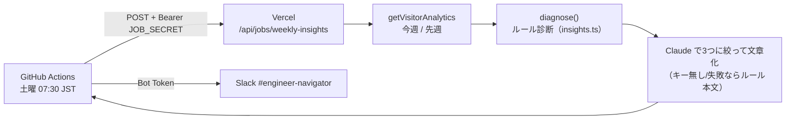
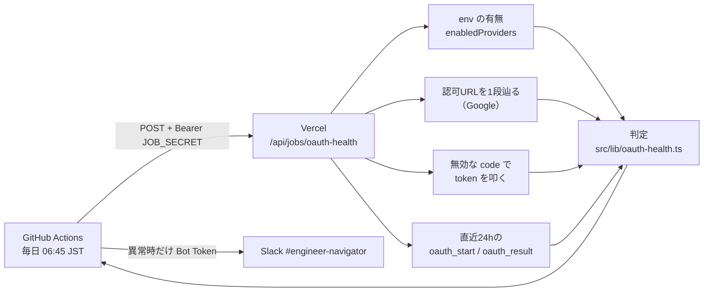

# 来訪者分析（Visitor Analytics）

「だれが来て、ゲストはどこで止まり、登録した人は戻ってくるか」を数字で見て、
サービス改善に繋げるための仕組み。3層に分けている。

| 層 | 見たいこと | 手段 | 場所 |
|---|---|---|---|
| 1 | ログイン後の行動・ゲスト→登録ファネル・定着 | **サーバー側イベント + 既存テーブル** | `/admin/analytics` |
| 2 | 公開ページ（LP・公開プロフィール・良問）の流入元・PV | **Vercel Web Analytics**（cookieなし） | Vercel ダッシュボード |
| 3 | 決まった画面にない自由な集計 | **Looker Studio → Neon 読み取り専用ロール** | Looker Studio |

方針:
- **PIIゼロ**はここでも守る。イベントに入れるのは機能ID・プロバイダ名・結果コードだけ。自由入力・IP・UAは入れない
- **記録はサーバー側だけ**（Route Handler / Server Action / サーバーコンポーネント）。クライアントJSに頼ると
  広告ブロッカーやWKWebView（モバイルアプリ）で欠損し、ゲストの数字が歪む
- 記録の失敗は本体を止めない（`track()` は throw しない）

## 1. サーバー側イベント（`AppEvent`）

書くのは `src/lib/analytics/track.ts` の `track(EVENT.xxx, { userId, props })` だけ。イベント名は
`EVENT` 定数からしか取れない（自由文字列で増やさない）。

| name | いつ | props | どこで書く |
|---|---|---|---|
| `guest_start` | ゲストを発行 | — | `api/guest/start` |
| `guest_gate` | ゲストが登録限定の機能で弾かれた | `app`（report / mentor / ai:mentor-chat …）, `via`（page / action / ai） | `lib/guest.ts`, `lib/usage.ts` |
| `guest_needsaccount` | 弾かれて /welcome の「登録すると使えます」を見た | — | `welcome/page.tsx` |
| `oauth_start` | OAuthを開始 | `provider`, `guest`（ゲストからか）, `mobile` | `api/auth/[provider]/start` |
| `oauth_result` | OAuthの結果 | `provider`, `outcome`（new / login / linked / promoted / already-linked / fail）, `reason`（failのみ）, `guest` | `lib/oauth-login.ts`, callback |
| `guest_promoted` | ゲストが本登録に昇格 | `provider` | `lib/oauth-login.ts` |

あわせて `User.promotedAt` を追加した（昇格日時）。`createdAt` との差が「お試しから登録までの日数」。

`guest_gate` の `app` は middleware が付けるヘッダ `x-en-pathname`（`PATHNAME_HEADER`）の先頭セグメント。
Server Action の POST もページURLに飛ぶので同じ経路で取れる。AI入口は `ai:<kind>`。

### 増やすとき
1. `track.ts` の `EVENT` と上の表に1行足す
2. props は「集計に使う値」だけ。人が書いた文章は入れない
3. ファネルの段にするなら `src/lib/analytics/stats.ts` の `guestFunnel` に足し、`stats.test.ts` を更新

## 2. `/admin/analytics` の読み方

- **VISITORS**: 日次ユニーク訪問（`UserVisit`）。ゲスト=pink / 登録済み=royal。ゲストの棒だけ伸びて
  登録済みが横ばいなら、ファネルを見る
- **GUEST FUNNEL**: 直近30日にゲストとして作られた人のうち、各行動をした**人数**（件数ではない）
  - 「2日目も来た」が低い → 初日の体験（育てて潜る）が弱い
  - 「登録限定に触れた」が低い → 登録の動機に出会えていない（遮断機能の露出を増やす）
  - 「登録案内を見た」が「触れた」より大きく低い → 弾かれた先で案内が出ていない（2026-09-10 修正済み。下記）
  - 「連携を始めた」→「登録完了」で減る → OAuth途中の失敗。右下の結果一覧で理由を見る
  - **既存アカウントと衝突（already-linked）** が出る → お試しのデータが宙に浮く。増えるならマージ導線を作る
- **RETENTION**: 登録週ごとの D1/D7/D30（登録からN日以上あとの訪問）。「—」は判定にはまだ早い
- **FEATURES**: 30日に各機能を使った人数。登録済みに対する割合で「使われていない機能」を見る

制約: イベントは導入日（画面に表示）以降しか無い。それ以前のゲストは中間の段が欠ける。
昇格済みユーザーの `promotedAt` も導入以降のみ。

### 2026-09-10 に見つけて直したハードル
登録限定ページはゲストを `/welcome?guest=needsaccount` に戻していたが、welcome はこのパラメータを
無視しており、**弾かれた理由も登録の導線も出さずLPをもう一度見せていた**（「ためしてみる」を押しても
`/` に戻るだけ）。ゲストでwelcomeに来たときは TRY を消し、「その機能は登録すると使えます／連携すると
引き継がれます」の UNLOCK 枠と「Googleで連携して登録」ボタンに切り替えた。効果は `guest_needsaccount`
→ `oauth_start(guest=true)` の落差で追う。

## 3. Vercel Web Analytics（公開ページ）

`src/components/public-analytics.tsx`。`beforeSend` で **/welcome, /u/, /q/, /contact, /join/ 以外は送らない**。
cookieを使わないので同意バナー不要。ログイン後のページは送らない（外部送信の最小化）。

有効化（1回・Vercel側）: プロジェクト → **Analytics** タブ → Enable。有効化するまでスクリプトは何も送らない。
見るもの: 流入元（Referrer）・UTM・LPのPV・国。**GA4 を入れる場合**は Search Console/広告連携が要るときだけ。
その際は外部送信の記載をプライバシーポリシーに足す。

## 4. Looker Studio → Neon（自由集計）

決まった画面で足りないときは Neon に**読み取り専用ロール**を作って Looker Studio の PostgreSQL コネクタで繋ぐ。
ハンドル名しか無いデータなので外に出しても安全だが、`Inquiry`（問い合わせ本文）と `AuthIdentity`（ハッシュ）は
念のため GRANT しない。

```sql
-- Neon の SQL Editor（direct 接続）で1回
CREATE ROLE bi_reader WITH LOGIN PASSWORD '<長いランダム文字列>';
GRANT CONNECT ON DATABASE neondb TO bi_reader;
GRANT USAGE ON SCHEMA public TO bi_reader;
GRANT SELECT ON
  "User", "UserVisit", "AppEvent", "AiUsage", "WeeklyReport", "QuizAttempt",
  "DungeonRun", "MentorSession", "RoleplaySession", "YomoyamaPost", "Purchase", "Encounter"
TO bi_reader;
```

Looker Studio: データを追加 → PostgreSQL → ホスト（Neon の pooled ホスト）・DB・`bi_reader`・パスワード、
**SSL を有効**にする。よく使う集計例:

```sql
-- ゲストの登録率（週別）
SELECT date_trunc('week', "createdAt") AS week,
       count(*) AS guests,
       count("promotedAt") AS promoted,
       round(100.0 * count("promotedAt") / count(*), 1) AS rate
FROM "User"
WHERE role = 'GUEST' OR "promotedAt" IS NOT NULL
GROUP BY 1 ORDER BY 1;

-- 弾かれた機能（30日）
SELECT props->>'app' AS app, count(*) FROM "AppEvent"
WHERE name = 'guest_gate' AND "createdAt" > now() - interval '30 days'
GROUP BY 1 ORDER BY 2 DESC;
```

注意: 無料枠の Neon は自動サスペンドするので最初の読み込みが遅い。

## 5. 週次テコ入れ提案（Slack・土曜朝）

毎週土曜 07:30 JST に `.github/workflows/weekly-insights.yml` が本番の `POST /api/jobs/weekly-insights` を
叩き、返ってきた本文を `#engineer-navigator` に投稿する（`scripts/insights/post.ts`）。



- **診断はルール、AI は文章化だけ**。`src/lib/analytics/insights.ts` の `diagnose()` が
  「ゲストが少ない→集客」「ファネルの最大落差→その段の対策」「既存アカウント衝突」「OAuth失敗率」
  「D7定着」「週報未使用」「WAU前週比」を決定的に判定する（テストは insights.test.ts）。
  AI は所見を土台に最大3つへ絞り、行動を具体化する。数字を作らないよう system で縛る
- **手動実行**: Actions の「来訪者分析の週次提案」→ Run workflow。`no_ai` でルール診断のみ、`dry_run` で投稿なし
- **ローカル確認**: `JOB_SECRET=<.envの値> npm run insights:post -- --dry-run`（本番を叩く。ローカルの
  dev サーバーに向けるなら `APP_URL=http://localhost:3000`）
- **必要な設定**: Vercel の環境変数 `JOB_SECRET`（長いランダム文字列）と GitHub Secrets の `JOB_SECRET`
  を同じ値にする。`SLACK_BOT_TOKEN` はトリアージと共用。JOB_SECRET が Vercel に無いと API は 503 を返す
- AI 呼び出しは週1回・ユーザーに紐づかないため、ユーザー別のレート制限（assertAiAllowed）は通していない

## 6. OAuth登録の見張り（毎朝・異常時だけSlack）

「Google / GitHub で登録しようとしたらコケる」を利用者の報告より先に気づくための日次チェック。
毎日 06:45 JST に `.github/workflows/oauth-health.yml` が本番の `POST /api/jobs/oauth-health` を叩き、
**異常があるときだけ** `#engineer-navigator` に流す（Actions の実行も赤くなる）。



| チェック | 何が分かるか | 正常 | 異常 |
|---|---|---|---|
| enabled | Vercel の `*_CLIENT_ID / _SECRET` が揃っているか。欠けると**登録ボタンが黙って消える** | 両方あり | 欠け |
| authorize（Google） | client_id・redirect_uri がGoogleに登録されているか | ログイン画面へ302 | `/signin/oauth/error?authError=…`（`invalid_client`・`redirect_uri_mismatch` 等）へ302 |
| token | client_secret が生きているか（GitHub は redirect_uri も） | Google `invalid_grant` ／ GitHub `bad_verification_code`（＝認証は通り code だけ不正） | `invalid_client`・`incorrect_client_credentials`・`redirect_uri_mismatch`・404 |
| events | 実ユーザーで失敗していないか（プロバイダ障害・モバイル固有の失敗も拾う） | — | 開始3件以上で成功0件 ／ `exchange` 1件〜 ／ `state` 3件〜 ／ `ticket`（モバイル引換券）2件〜 |

- GitHub は未ログインだと認可URLが何も検証せず `/login` へ飛ぶため、authorize は判定せず token 側で見る
- Google の応答の形は 2026-09 に実際に curl で確認した（テストに実応答を置いている）。プロバイダが形を変えると
  「想定外の応答」として 🟧 warn で出るので、そのときは `classifyAuthorize` / `classifyToken` を更新する
- **見張れないもの**: Google の OAuth 同意画面が「テスト」状態のまま（テストユーザー以外が弾かれる）。
  これは実ユーザーの events（開始あり・成功0）でしか出ないので、公開ステータスは Cloud Console で一度確認しておく
- **コードの退行**（callback・ゲスト昇格を触って壊す）はこの見張りの対象外。偽プロバイダを使ったE2Eで守る（未実装）
- **手動実行**: Actions の「OAuth登録の見張り（日次）」→ Run workflow。`always` で異常なしでも投稿、`dry_run` で投稿なし
- **ローカル確認**: `JOB_SECRET=<.envの値> npm run oauth:health -- --dry-run`
- **必要な設定**: 5. と共通（`JOB_SECRET`・`SLACK_BOT_TOKEN`）。追加設定なし

## 次の一手（データが溜まったら）
- ファネルの落差が「登録案内を見た→連携を始めた」なら、案内の文言・ボタンの位置を変えて2週比較
- 「既存アカウントと衝突」が月に数件出るなら、ゲストのデータを既存アカウントへマージする導線
- セッション単位の動線（どの順で画面を回ったか）まで見たくなったら PostHog を検討（いまの規模では過剰）
