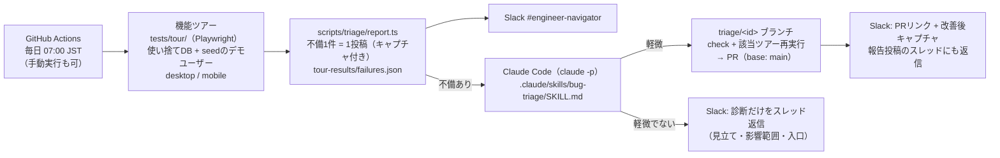

# 日次バグトリアージ

毎朝、テスト用アカウントでアプリの全画面を一周し、不備を Slack `#engineer-navigator` に
キャプチャ付きで報告する。軽微なものは Claude Code が main から派生したブランチで修正して
PR を作り、リンクと改善後キャプチャを投稿する。人の仕事は **朝の Slack を見て PR をマージするか判断する** こと。



## 3つの部品

| 部品 | 場所 | 役割 |
|---|---|---|
| 機能ツアー | `tests/tour/`・`playwright.tour.config.ts` | 全画面をロールごとに一周し、エラー画面・未捕捉例外・5xx・主要導線の破綻を検出。成功時もキャプチャを `tour-results/screens/` に残す |
| 報告 | `scripts/triage/report.ts`・`slack.ts` | Playwright の JSON レポートを不備単位（ツアー id）にまとめ、1件1投稿。同じ id の修正PRが open なら「既知」として修正対象から外す |
| 修正 | `.claude/skills/bug-triage/SKILL.md` | 「軽微」の判定基準・ブランチ運用・検証・PR・Slack投稿の手順。CI からも手元（`/bug-triage`）からも同じ手順で動く |

ツアーは E2E スモーク（`playwright.config.ts`）と同じ使い捨てDB（`engineer_navigator_e2e`）・
同じポート（3111）を使う。実 Claude API は呼ばない（AI解析は FAILED になるのが仕様）ので
検出フェーズは無料・決定的。API を使うのは修正フェーズだけで、1回あたりの上限を `TRIAGE_BUDGET_USD` で切る。

## 崩れの検出（レイアウトの構造チェック）

ピクセル比較（視覚回帰）は採用しない。デザイン変更のたびに基準画像の更新が要り、
日付・来訪ペットの抽選・トーストなど意図しない差分の種も多く、CI（Linux）と Mac で
フォント描画が違うため基準画像が CI 専用になる——この運用は形骸化しやすい。

代わりに、崩れの大半を占めるパターンを DOM から決定的に判定する（`tests/tour/helpers.ts` の
`scanLayout`。各ツアー末尾の `assertHealthy` で全画面に効く。基準画像不要）:

| 判定 | 内容 | 扱い |
|---|---|---|
| `overflow` | ページ幅がビューポートを超える（横スクロールが発生）。はみ出した最内側の要素を添える | **失敗**（不備として報告・軽微なら修正PR） |
| `covered` | `position: fixed` の要素（ドック・浮遊ボタン等）が操作要素の中心を覆っている。モーダルが開いていればモーダル内だけを見る。sticky（スクロールで潜るのが通常挙動）とトーストは対象外 | **失敗** |
| `tiny` | スマホで 24px 未満のボタン | **警告**（サマリのスレッドに「💡 気づき」として1投稿。自動修正の対象外） |

レトロ風ウィンドウ枠の「×」のような小さな閉じるボタンは意図的なデザインなので、
警告止まりにして人が判断する。閾値を変えたいときは `LAYOUT_REPORT_ONLY=1 npm run test:tour`
で「落とさずログに出す」モードにして全画面の結果を見てから決める。

これで拾えないもの（文字の重なり・配色の読みにくさ等）は、当面は人の目で拾う。
将来の候補は末尾の「AI 探索テスト」（毎朝のキャプチャを Claude に見せて気づきを流す）。

## 「軽微」の基準（SKILL.md と同じ）

1〜2ファイルに閉じる / 差分50行以内 / スキーマ・マイグレーションに触らない /
認証・権限・課金・AIレート制限・コンディション（労務データ）に触らない / 仕様の解釈が要らない /
AGENTS.md の決まりごとを破らずに直せる。**1つでも外れたら修正せず診断のみ**。
ツアー側（セレクタの古さ）が原因なら直すのはテスト。

## セットアップ（初回だけ・人がやる）

### 1. Slack App を作る（Bot Token）

既存の Incoming Webhook（`SLACK_WEBHOOK_URL`）は画像を添付できないので、Bot Token を使う。

1. https://api.slack.com/apps → Create New App → **From a manifest** → ワークスペースを選び、
   JSON タブに下を貼って Create（Bot と3つの権限が一度に付く）
   ```json
   {
     "display_information": { "name": "engineer-navigator-triage", "description": "日次バグトリアージの報告Bot" },
     "features": { "bot_user": { "display_name": "engineer-navigator-triage", "always_online": false } },
     "oauth_config": { "scopes": { "bot": ["chat:write", "files:write", "files:read"] } },
     "settings": { "org_deploy_enabled": false, "socket_mode_enabled": false, "token_rotation_enabled": false }
   }
   ```
   テンプレート（AI agent / Starter app）から作った場合は OAuth & Permissions → Bot Token Scopes に
   上の3つが揃っているか確認し、足りなければ追加して Reinstall する
2. 作成直後の画面か OAuth & Permissions で **Bot token（`xoxb-...`）** を控える（`xapp-` の App token は使わない）
3. 手元で疎通確認: `SLACK_BOT_TOKEN=xoxb-... npx tsx scripts/triage/slack.ts --text "疎通テスト" --file tour-results/screens/home-desktop.png`
4. `#engineer-navigator`（公開チャンネル）で `/invite @<アプリ名>` して Bot を入れる
   （公開でも画像付き投稿は Bot がチャンネルに参加している必要がある）

### 2. GitHub の Secrets / Variables

| 種別 | 名前 | 値 | 必須 |
|---|---|---|---|
| Secret | `SLACK_BOT_TOKEN` | 上の `xoxb-...` | ✅（無いと console 出力だけになり Slack に届かない） |
| Secret | `ANTHROPIC_API_KEY` | Claude API キー（修正フェーズ用） | ✅（無いと修正フェーズが失敗する。検出・報告は動く） |
| Secret | `TRIAGE_GH_TOKEN` | PAT。sysnavi は Organization で fine-grained が許可されていないため **Classic token（`repo` スコープ）** を使う | 推奨（下記） |
| Variable | `SLACK_TRIAGE_CHANNEL` | チャンネルID。既定 `C0C03HE4H2B`（#engineer-navigator） | 任意 |
| Variable | `TRIAGE_MODEL` | 修正フェーズのモデル。既定 `claude-sonnet-5` | 任意 |
| Variable | `TRIAGE_BUDGET_USD` | 修正フェーズの1回上限。既定 `5` | 任意 |

```bash
gh secret set SLACK_BOT_TOKEN
gh secret set ANTHROPIC_API_KEY
gh secret set TRIAGE_GH_TOKEN
```

**`TRIAGE_GH_TOKEN` が要る理由**: `GITHUB_TOKEN` で作った PR には CI（ci.yml）が自動起動しない
（GitHub の再帰防止仕様）。修正フェーズ自体が `npm run check` と該当ツアーを回してから PR を
出すので致命ではないが、PR 上の ✅ を見てマージしたいなら PAT を置く。

### 3. 動作確認

```bash
gh workflow run "バグトリアージ（日次）"            # 手動実行（修正まで）
gh workflow run "バグトリアージ（日次）" -f fix=false  # 検出・報告だけ
gh run watch
```

## 手元で回す

```bash
npm run test:tour                 # ツアー全体（docker compose up -d が前提）
TOUR_ONLY=home npm run test:tour  # 1本だけ（id は tests/tour/tour.spec.ts の tour("<id>", ...)）
npm run triage:report             # Slack 報告 + failures.json（SLACK_BOT_TOKEN 未設定なら console に出るだけ）
```

その後 Claude Code で `/bug-triage` を呼べば、CI と同じ判定・修正手順が手元で走る
（手元では PR 作成前に内容を見せてもらうよう頼めばよい）。

## 運用ルール

- 修正PRのブランチは `triage/<id>`。同じ不備が翌日も検出されたら「既知（PR #n 未マージ）」と
  報告されるだけで、二重に修正はしない。**PR を放置するとその不備は毎朝リマインドされる**
- 修正PRのマージは人が判断する（自動マージしない）。マージ後は通常どおり Vercel に出る
- Slack に「✅ すべて正常」が朝に来ていなければ、ルーティン自体が壊れている
  （Actions の失敗通知を見る）。沈黙＝正常ではない設計
- ツアーが検出できるのは「壊れている」こと（エラー画面・例外・5xx・導線の断絶）と、
  構造的な崩れ（横スクロール・固定要素の覆い）まで。文字の重なりや文言の違和感は
  検出できない。それらは従来どおり人の目で拾う
- 新しい画面を足したら `tests/tour/tour.spec.ts` に1本足す。忘れると `npm run check` の
  網羅ガード（`tests/tour/coverage.test.ts`: 全 page.tsx を訪問するツアーがあるか）で止まる
- 既存画面の導線を変えたら同じPRで該当ツアー（`TOUR_ONLY=<id>`）を回して直す（/feature の手順）。
  ツアーの大半は「開く→見出し→エラーなし」だけなので、文言やレイアウトの変更では壊れない

## 将来の拡張候補（未実装）

- **本番の読み取り専用スモーク**: 招待トークンで本番（Vercel）にログインし GET だけ一周。
  デプロイ環境固有の不備（環境変数・Neon）を拾える。書き込み系は本番DBを汚すのでやらない
- **AI 探索テスト**: スクリプト化されたツアーの外側を Claude が触って回る。コストと
  非決定性が増えるので、まずはスクリプトのツアーで運用してから判断
- **視覚回帰**: `toHaveScreenshot` で前日との差分を検出。デザインが安定した数画面に限るなら
  検討の余地あり（全画面に掛けると基準更新が運用負荷になる。上の「崩れの検出」参照）
