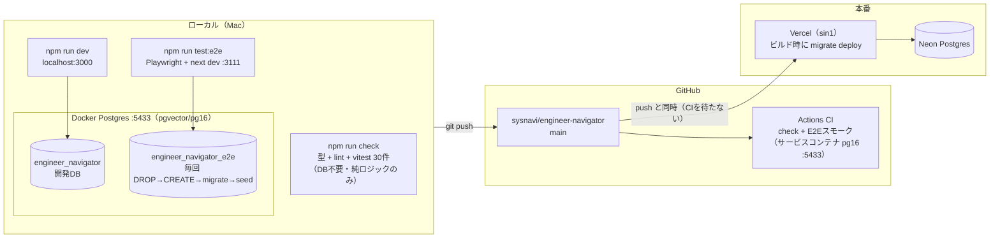
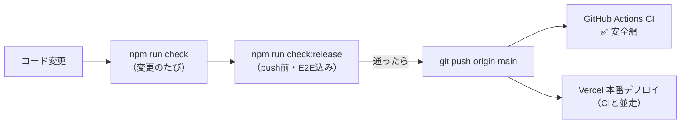
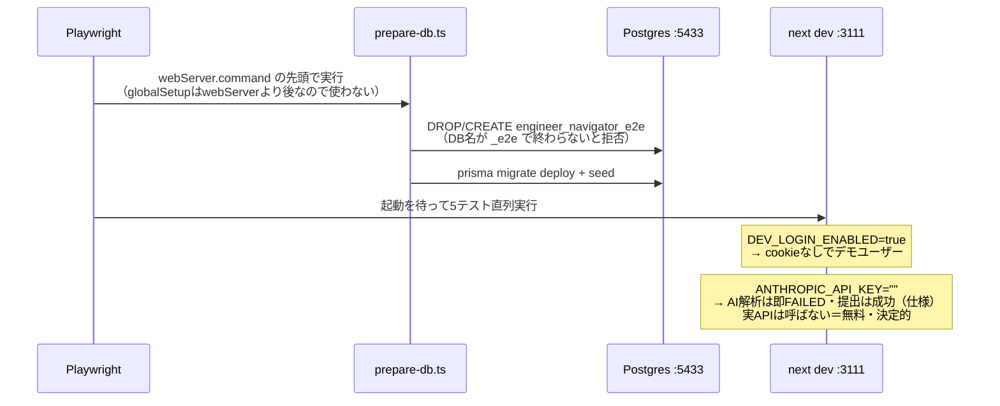

# 開発・テスト・リリース基盤の図解

依頼 → 実装 → 検証 → リリースの流れを支える環境の全体像。
コマンドの使い方は AGENTS.md、デプロイ手順と CI の詳細は DEPLOY.md を参照。

## 全体マップ

3つの実行環境（ローカル開発 / E2E / CI）と本番の関係。
**E2E はローカル開発と完全分離**（別ポート・別DB）なので、`npm run dev` を
立ち上げたまま `npm run test:e2e` を実行してよい。

## リリースゲート

ゲートの本体はローカルの `check:release`。CI は同じ内容を GitHub 上で
再実行する**事後の安全網**で、Vercel のデプロイはブロックしない
（ハードゲート化の選択肢は DEPLOY.md）。

## E2E の中身

外部依存ゼロ・決定的に回すための仕掛け。

スモークの5本: ホーム表示 / 週報の入力→自動保存→提出→リザルト /
今日の一問に解答→採点 / スキルマップ / ウェルカム（公開ページ）。

## 決まりごと（テスト設計）

- **ユニット**: `src/**/*.test.ts` に併置。DBに触らない純ロジックだけを対象にする
  （週の境界・レベルカーブ・ルーブリック・げんばの決定性など「壊れると全員に効く」計算）
- **E2E**: tests/e2e/。seed直後の状態を前提に書いてよい（毎回リセットされるため）。
  初回チュートリアルは `closeTutorialIfShown` で閉じる
- **CIとローカルの差をなくす**: CIのDBもローカルと同じイメージ・同じポート(5433)に
  合わせてあるので、接続設定の分岐が存在しない
