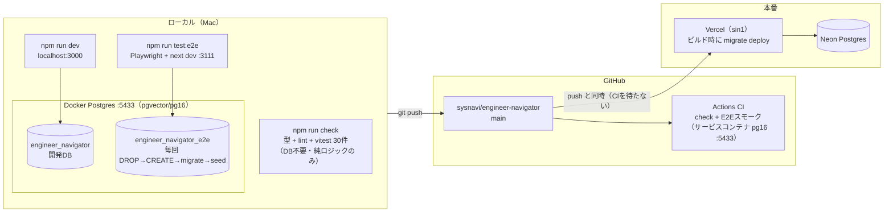
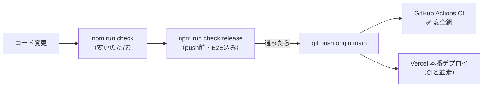
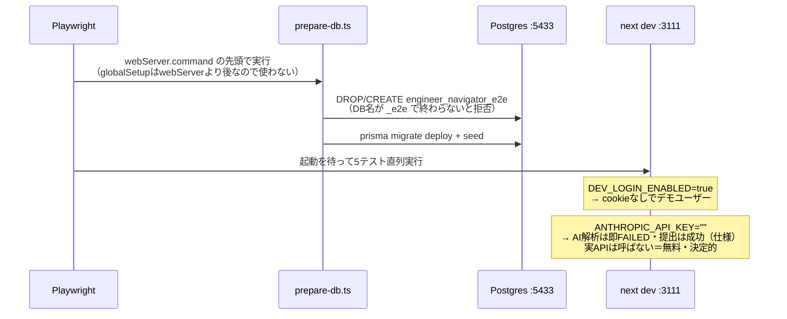
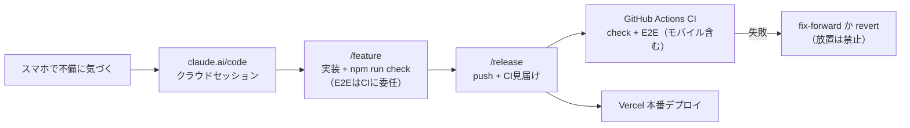

# 開発・テスト・リリース基盤の図解

依頼 → 実装 → 検証 → リリースの流れを支える環境の全体像。
コマンドの使い方は AGENTS.md、デプロイ手順と CI の詳細は DEPLOY.md を参照。

## 全体マップ

3つの実行環境（ローカル開発 / E2E / CI）と本番の関係。
**E2E はローカル開発と完全分離**（別ポート・別DB）なので、`npm run dev` を
立ち上げたまま `npm run test:e2e` を実行してよい。

## リリースゲート

ゲートの本体はローカルの `check:release`。CI は同じ内容を GitHub 上で
再実行する**事後の安全網**で、Vercel のデプロイはブロックしない
（ハードゲート化の選択肢は DEPLOY.md）。

## E2E の中身

外部依存ゼロ・決定的に回すための仕掛け。

スモークの5本: ホーム表示 / 週報の入力→自動保存→提出→リザルト /
今日の一問に解答→採点 / スキルマップ / ウェルカム（公開ページ）。
うち描画系3本（`@mobile` タグ）は **iPhoneビューポートでも再実行**され、
スマホ表示の崩れをCIで検知する。

補足: Next 16 は同一 distDir での多重 dev 起動をロックで拒否するため、
E2E は `NEXT_DIST_DIR=.next-e2e` でビルドディレクトリも分離している
（`npm run dev` と同時に実行できるのはこのため）。

## スマホ（外出先）からの修正フロー

外出先で不備に気づいたら、スマホの claude.ai/code からクラウドセッションで修正する。
クラウドにはローカルDBがないので、E2Eの実行は push 後の CI が担う——
このフローの品質ゲートは CI（だから push 後の見届けが /release の必須手順）。

デザインの微調整（目視必須のもの）はローカル作業に切り替える。
クラウドで対応するのは挙動バグ・明白なCSS崩れ・文言などまで。

## Skills（.claude/skills/・コミット対象）

手順の標準化。クラウドセッションでも同じ手順が読まれるようリポジトリに含める。

- **/feature** — 依頼→分類→実装（AGENTS.mdの決まりごとチェックリスト）→検証→コミット。
  環境検知（DBの有無）でフル検証/クラウドモードを分岐
- **/release** — push前ゲート→push→CI見届け→失敗時の巻き取り（fix-forward / revert）

## 決まりごと（テスト設計）

- **ユニット**: `src/**/*.test.ts` に併置。DBに触らない純ロジックだけを対象にする
  （週の境界・レベルカーブ・ルーブリック・げんばの決定性など「壊れると全員に効く」計算）
- **E2E**: tests/e2e/。seed直後の状態を前提に書いてよい（毎回リセットされるため）。
  初回チュートリアルは `closeTutorialIfShown` で閉じる
- **CIとローカルの差をなくす**: CIのDBもローカルと同じイメージ・同じポート(5433)に
  合わせてあるので、接続設定の分岐が存在しない
