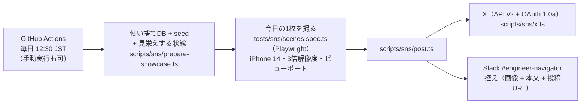

# SNS 投稿 Bot（日次）

毎日、テスト用アカウントでゲーム画面を1つ遊び、**スマホの画面そのまま**を撮って X に投稿する。
言葉で説明するのではなく、遊んでいる画面で楽しさを伝え続けるための仕組み。本文は一言 + ハッシュタグ + URL だけ。
控えは Slack `#engineer-navigator` に画像つきで流れるので、人は朝の Slack を見れば「今日は何が出たか」がわかる。



## 3つの部品

| 部品 | 場所 | 役割 |
|---|---|---|
| 見栄えする状態 | `scripts/sns/prepare-showcase.ts` | seed 直後のデモユーザーは仲間0・EN0・戦利品0 で空状態の画面ばかりなので、仲間2匹・所持金・ごはん・戦利品を足す。デスクトップOS風シェル + 日替わりパレット。来訪キャラは「来ない」に固定（本文に被る・日によって撮れ高がぶれるため） |
| 撮影 | `tests/sns/scenes.spec.ts`・`playwright.sns.config.ts` | シーン（画面 + 操作）を1つ選んで遊び、ビューポートを撮る。出力は `sns-results/<scene>.png` と `post.json`（本文） |
| 投稿 | `scripts/sns/post.ts`・`x.ts`・`src/lib/sns/x-oauth.ts` | X に画像付きで投稿し、控えを Slack に流す。キー未設定なら dry-run（console に出すだけ） |

ツアー（`docs/bug-triage.md`）と同じ使い捨てDB（`engineer_navigator_e2e`）・同じポート（3111）を使う。
実 Claude API は呼ばない（無料・決定的）。E2E・ツアーと同時には走らせない。

## シーンと巡回

| id | 画面 | 操作 | 一言 |
|---|---|---|---|
| `quiz-play` | 腕試し | SQL で出題 → 1問答える | 腕試し中。 |
| `dungeon` | ダンジョン | 潜る → 一人称ビューで数歩 | きょうも地下へ。 |
| `walk` | おさんぽ | 仲間が歩いて話すのを待つ | うちの子とおさんぽ。 |
| `myhome` | マイホーム | 戦利品が並ぶ机と仲間 | マイホーム、もようがえ中。 |
| `genba` | げんば | 案件一覧 | きょうの案件。 |
| `shop` | おかいもの | 商品一覧（EN あり） | おかいもの。 |
| `quiz-daily` | 今日の一問 | 1問答える | 今日の一問。 |
| `home` | ホーム | TODAY.sys とプレイヤーカード | きょうのステータス。 |

1日1シーン。日付（JST）で上から順に巡回する（`pickScene`）。パレット（きせかえ）も日替わりで別周期なので、同じシーンでも見た目が毎回少し違う。
シーンを足すときは `SCENES` に1件足すだけ（seed + showcase の状態で必ず成立する操作にする。AI は呼ばない）。

本文は `<一言>\n\n#engineer\nhttps://engineer-navigator.jp`。末尾は Variables の `SNS_TAIL` で差し替えられる。

## セットアップ（初回だけ・人がやる）

### 1. X Developer App（Free プランで足りる）

投稿は「ユーザーコンテキスト」（Bot として使うアカウントのアクセストークン）で行う。
OAuth 2.0 はリフレッシュトークンの寿命管理が要るので、無人ルーティンには失効しない OAuth 1.0a を使う。

1. https://developer.x.com/ で投稿用アカウントにログインし、Free で Project + App を作る
2. App の **User authentication settings** → App permissions を **Read and write** にして保存
   （Type of App は Web App / Automated App、Callback / Website URL は `https://engineer-navigator.jp` で可。使わない）
3. **Keys and tokens** → API Key and Secret を控える
4. 同じ画面の **Access Token and Secret** を **権限を Read and write にした後で** Generate する
   （先に生成したトークンは Read only のまま。「Created with Read and Write permissions」と出ていれば OK）
5. 手元で疎通確認（dry-run ではなく実投稿されるので注意）:
   ```bash
   X_API_KEY=... X_API_SECRET=... X_ACCESS_TOKEN=... X_ACCESS_SECRET=... \
     npx tsx scripts/sns/x.ts --text "テスト投稿" --file sns-results/quiz-play.png
   ```

Free プランの書き込み上限は月 500 件（2026-09 時点）。1日1投稿なら十分。

### 2. GitHub の Secrets / Variables

| 種別 | 名前 | 値 | 必須 |
|---|---|---|---|
| Secret | `X_API_KEY` / `X_API_SECRET` | App の API Key / Secret | ✅（4つ揃わないと dry-run になり X には出ない） |
| Secret | `X_ACCESS_TOKEN` / `X_ACCESS_SECRET` | Read and write で生成した Access Token / Secret | ✅ |
| Secret | `SLACK_BOT_TOKEN` | バグトリアージと共用（設定済み） | 推奨（無いと控えが Slack に届かない） |
| Variable | `SLACK_TRIAGE_CHANNEL` | 控えの投稿先。既定 `C0C03HE4H2B`（#engineer-navigator） | 任意 |
| Variable | `SNS_TAIL` | 本文の末尾（既定 `#engineer\nhttps://engineer-navigator.jp`） | 任意 |

```bash
gh secret set X_API_KEY
gh secret set X_API_SECRET
gh secret set X_ACCESS_TOKEN
gh secret set X_ACCESS_SECRET
```

### 3. 動作確認

```bash
gh workflow run "SNS投稿（日次）" -f dry_run=true          # Slack に控えだけ（X には出ない）
gh workflow run "SNS投稿（日次）" -f scene=walk             # シーンを指定して実投稿
gh run watch
```

## 手元で回す

```bash
SNS_SCENE=quiz-play npm run sns:capture   # 撮るだけ（docker compose up -d が前提）。sns-results/ に出る
SNS_PALETTE=gameboy npm run sns:capture   # パレットを固定（src/lib/palettes.ts の id）
npm run sns:post                          # X のキーが無ければ dry-run。SNS_DRY_RUN=1 でキーがあっても投稿しない
```

## 運用ルール

- 投稿は**自動**。止めたいときは Actions のワークフローを Disable する（Secrets を消しても dry-run になって止まる）
- 朝の Slack に「📸 SNS投稿」が来ていなければルーティン自体が壊れている（Actions の失敗通知を見る）。沈黙＝正常ではない設計
- 撮影が失敗した日は投稿しない（`post.json` が無ければ post.ts が落ちる）。壊れた画面を世に出さないための構造
- 画面の導線を変えてシーンが成立しなくなったら、同じPRで `SNS_SCENE=<id> npm run sns:capture` を回して直す（ツアーと同じ流儀）
- デモユーザーの表示名（`engineer-demo`）・仲間の名前がそのまま写る。実在の人・顧客名は seed にも showcase にも入れない

## 将来の拡張候補（未実装）

- **本文のバリエーション**: 一言を複数用意してランダムに。今は「画像が主役・言葉は最小」を徹底するため固定
- **他SNS**: Bluesky（AT Protocol は認証が簡単）・Threads。post.ts の後段を1つ足すだけ
- **反応の計測**: 投稿IDを AppEvent に残して /admin/analytics でクリック数と突き合わせる（docs/analytics.md）
- **動画（GIF）**: おさんぽ・ダンジョンは動きが魅力なので、数秒の録画も候補。X は動画 512MB・GIF 15MB まで
